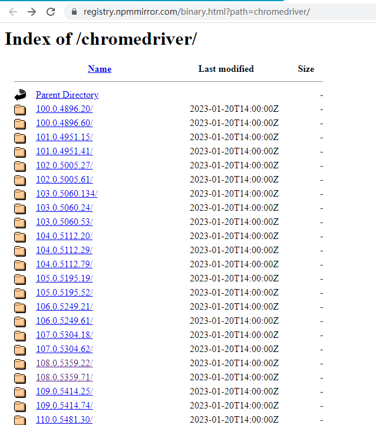

# Autor
An application that helps you with your Hangzhou Safety Education Tasks.

# How To Use
## Download Chrome WebDriver
As using Google Chrome, I choose Chrome WebDriver.You can change other webdriver like FireFox and so on.Where you should change is File "Autor\autor.py", Line 15.

	browser = webdriver.Chrome(options=chrome_options)

Click [Mirror Link](https://registry.npmmirror.com/binary.html?path=chromedriver/) then select and download the driver matching your browser version.

Unzip the .zip file and copy the .exe file to the same path of your script.

## Install Autor

Type the command below to install Autor.

``
	pip install Autor
``

## Test Autor
Here is a simple test script.

    from Autor.autor import login

	account = 'fengtangzheng'
	password = 'jDT3TBALkZ8rJ78'
	login(account, password)

Here is result.

	[*] fengtangzheng logging... 
	[+] Login succeeded.

	Process finished with exit code 0

## Write Your Script
By running the script below, Autor will help you solve your Hangzhou safety education tasks.

    from Autor.autor import help_me

	account = 'fengtangzheng'
	password = 'jDT3TBALkZ8rJ78'
	help_me(account, password)

# Function
There are some interesting functions in file author.py.
## login(_account, pwd)

These function is to login.

----------

Parameter Descript:

- _account(String): Your account.
- pwd(String): Your password.

Return Value:

- True(Boolean): Login succeeded.
- False(Boolean): Fail to login

----------

## get_tasks()

These function is to get your unsolved tasks in index.Before you use it, you should login first.

----------

Return Value:

- _task(List):Unsolved Tasks List 
e.g. 
[btn, flag, False] 

 1. btn(WebElement): unsovled task 
 2. flag(Boolean): Task Type.True for Question Type Task while False for Video Type Task. 
 3. False(Boolean): To be used.

----------

## safe\_study\_solution(_task)

These function is to solve question type tasks.

----------

Parameter Descript:

- _task(WebElement): Question type task.

----------

## video\_solution(_task)

These function is to solve question type tasks.However, it is imperfect.I will soon fix it.

----------

Parameter Descript:

- _task(WebElement): Video type task.

----------

## help\_me(_account, _pwd, view=False)

The function is to solve your tasks automatically.

----------

Parameter Descript:

- _account(String): Your account.
- _pwd(String): Your password.
- view(Boolean): True for visible process while False for invisible process.

----------

# End

这个项目完成的日子是1月21日，是除夕的日子，也是我的奶奶过世的日子。我现在不知道怀着怎样的心情在对这个项目收尾。听着屋外的鞭炮声，我开始回忆小的时候。从我读幼儿园开始，奶奶就陪着我，每次从幼儿园出来，都能看到奶奶都站在门口等我，带着她充满慈爱的笑容。在回家的路上，我总是有很多奇怪的想法说给她听，她不明白我的想法，却始终怀揣着笑容鼓励我去做我想做的事情。后来我长大了，奶奶回老家生活了，虽然很想念她，不过每年也是可以回去看看她，给她看我的奖状，给她讲我的收获，我也可以再看看她的笑容。再后来，我中考失利，进入了高中，因为赛事和疫情，我没有再回过老家，每次过年，也都是以视频的形式联系她。就在昨天，江西的正年，老家来电，奶奶病倒了，我的心悬起，对着满满一桌饭菜，却一点提不起食欲。我很愧疚，我原本想着好好读书，等高考结束，带着我的录取通知书，风风光光地回家。可惜一切，都晚了。

# Author

## Lorenzo Feng(正崽不emo)
paradise_c@qq.com

